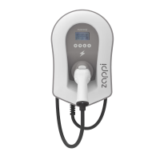

# Myenergi - Zappi unlock (Home Assistant)


Automation blueprint to unlock Zappi after EV has been connected and location (device tracker) is set to "home".


> [!TIP]
> Requires curl command!


## configuration.yaml
```yaml
  shell_command:
      myenergi_curl_get: 'curl --digest -u {{ url }}'
